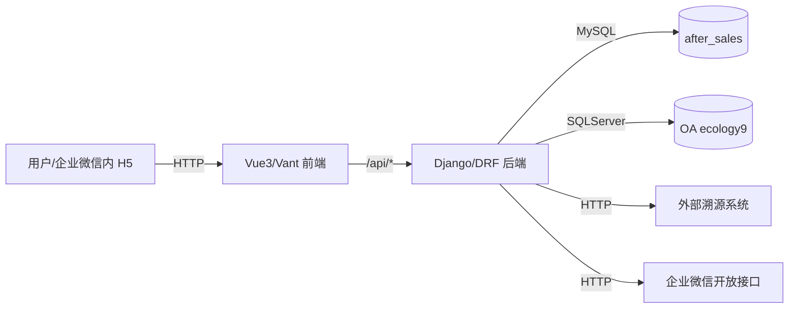
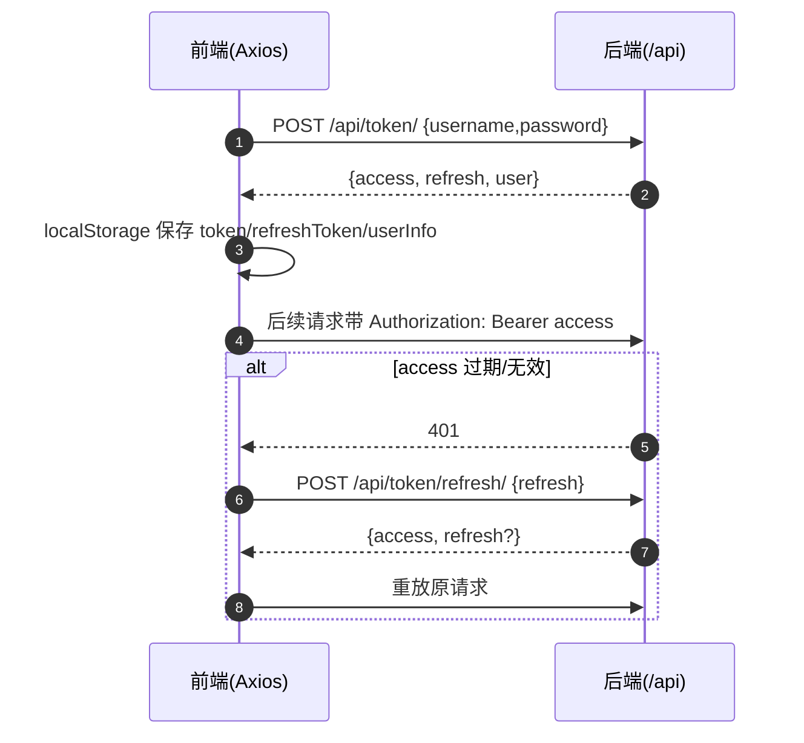
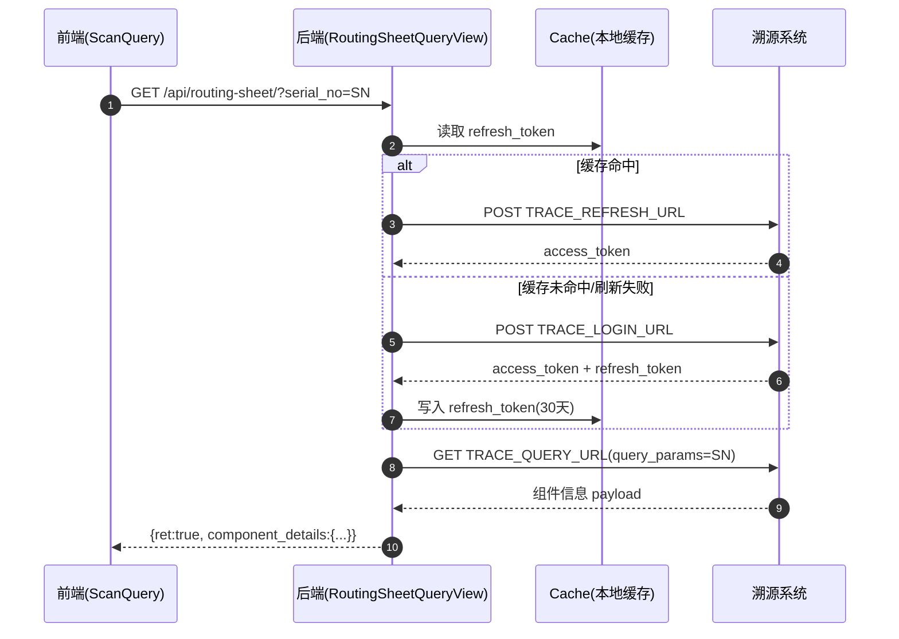

# 01. 项目整体架构

## 1.1 仓库分层

- **Frontend（H5）**：仓库根目录 [src](file:///workspace/src)
  - 负责登录态管理、页面路由、客诉录入与查询、企业微信扫码调用。
- **Backend（API）**： [after-sales-backend](file:///workspace/after-sales-backend)
  - 负责用户注册/登录、JWT 颁发与鉴权、客诉 CRUD、溯源系统查询代理、企业微信 JS-SDK 签名下发。

## 1.2 高层组件图

## 1.3 关键数据流

### 1) 登录与刷新

对应实现：

- 前端请求封装与自动刷新： [api/index.js](file:///workspace/src/api/index.js)
- 前端路由守卫（过期判断/回跳）： [router/index.js](file:///workspace/src/router/index.js)
- 后端登录签发：`TokenLoginView`（见 [views.py](file:///workspace/after-sales-backend/apps/sales/views.py)）
- 后端认证：`AfterSalesJWTAuthentication`（见 [authentication.py](file:///workspace/after-sales-backend/apps/sales/authentication.py)）

### 2) 客诉创建/查询

- 前端页面：
  - 新建： [ComplaintEntry.vue](file:///workspace/src/views/ComplaintEntry.vue)
  - 列表： [ComplaintList.vue](file:///workspace/src/views/ComplaintList.vue)
  - 详情： [ComplaintDetail.vue](file:///workspace/src/views/ComplaintDetail.vue)
- 后端 API：
  - `/api/complaints/`（list/create）
  - `/api/complaints/<id>/`（detail/update）
- 数据模型：
  - `After_sales_Complaint`（见 [models.py](file:///workspace/after-sales-backend/apps/sales/models.py)）

### 3) 溯源查询（Routing Sheet）

对应实现：

- 后端：`RoutingSheetQueryView`（见 [views.py](file:///workspace/after-sales-backend/apps/sales/views.py)）
- 前端：`getRoutingSheet`（见 [api/index.js](file:///workspace/src/api/index.js)）

### 4) 企业微信扫码（JS-SDK）

- 前端：`initWeComConfig` / `scanQRCode`（见 [wecom.js](file:///workspace/src/utils/wecom.js)）
- 后端：`WeComJSConfigView` 负责生成 `wx.config` 所需签名（见 [views.py](file:///workspace/after-sales-backend/apps/sales/views.py)）

## 1.4 模块边界（目录到职责映射）

| 目录 | 职责 |
|---|---|
| [src/api](file:///workspace/src/api) | Axios 实例、JWT 注入、401 自动 refresh、封装业务 API |
| [src/router](file:///workspace/src/router) | 路由表、登录态守卫（token 过期判断/回跳） |
| [src/store](file:///workspace/src/store) | Pinia store 容器（当前仅创建实例） |
| [src/utils](file:///workspace/src/utils) | 企业微信 JS-SDK 封装（扫码等） |
| [src/views](file:///workspace/src/views) | 页面级组件（登录/注册/客诉/扫码查询等） |
| [after_sales_backend_project](file:///workspace/after-sales-backend/after_sales_backend_project) | Django 项目配置（settings/urls/wsgi/asgi） |
| [apps/sales](file:///workspace/after-sales-backend/apps/sales) | 售后业务 App（认证、模型、序列化、视图、路由） |

