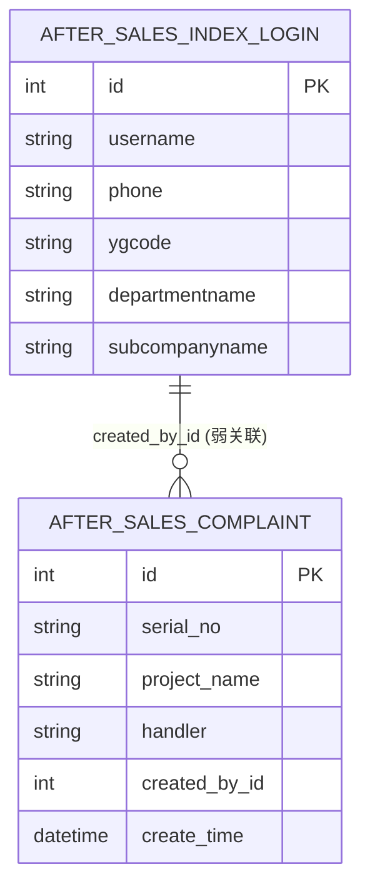

# 06. 数据库与数据模型

## 6.1 数据库连接概览

数据库配置位于 [settings.py](file:///workspace/after-sales-backend/after_sales_backend_project/settings.py) 的 `DATABASES`：

- `default`：MySQL（售后业务库，包含用户表与客诉表）
- `sqlserver_oa_ecology9`：SQLServer（OA 人员/组织信息，用于注册和工号查询）
- `DataBase`：另一个 MySQL（配置存在，但本仓库未见直接业务代码使用）

## 6.2 业务表模型（apps/sales/models.py）

模型文件： [models.py](file:///workspace/after-sales-backend/apps/sales/models.py)

关键点：

- 两个模型都设置 `managed = False`，表示 Django ORM **不负责建表/迁移**，而是直接映射已有表。

### 6.2.1 After_sales_index_login（用户）

- 表名：`after_sales_index_login`
- 用途：登录与用户资料、组织字段承载（注册时从 OA 补齐）

代表性字段：

- 账号：`username` / `password` / `phone`
- OA 关联：`oa_userid` / `ygcode`
- 组织信息：`departmentid/subcompanyid` + `departmentname/subcompanyname`

### 6.2.2 After_sales_Complaint（客诉）

- 表名：`after_sales_Complaint`
- 用途：客诉主表，包含客诉内容与处理信息

代表性字段：

- 基础信息：`serial_no/project_name/location/is_warranty`
- 处理信息：`handler/status/process_type/replace_serial_no/repairer`
- 维修详情：`repair_details`（JSONField）
- 审计：`created_by_id/create_time/update_time`

## 6.3 简易 ER 图

说明：

- `After_sales_Complaint.created_by_id` 以整数形式记录创建人 ID，并非 Django 外键字段；查询与关联需要手动维护一致性。

## 6.4 OA（SQLServer）读取点

OA 读取发生在：

- 注册：`RegisterView.post`（查询 `HrmResource`、`HrmDepartment`、`HrmSubCompany`）
- 工号查姓名：`SelYgbhInfo.post`

实现见： [views.py](file:///workspace/after-sales-backend/apps/sales/views.py)

